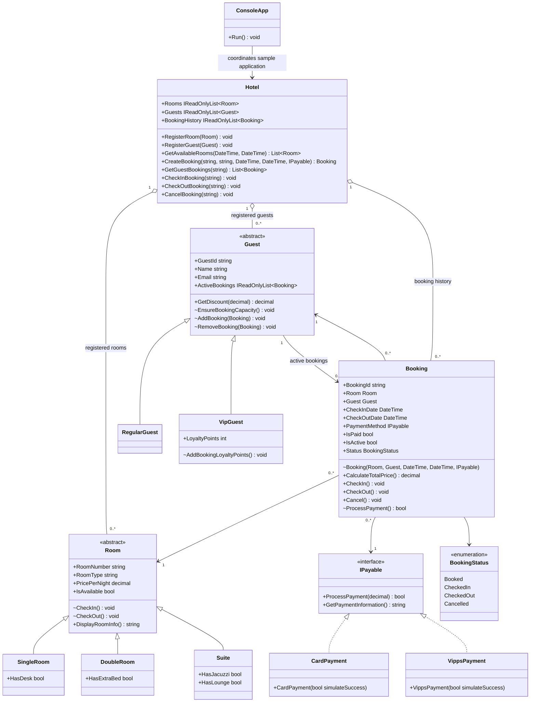

# Application architecture

The Mermaid diagram below is the maintained class model for the `HotelBookingSystem` application. `+` indicates public members and `~` indicates internal members. Only principal members are shown.

All types use the `HotelBookingSystem` namespace family. Booking identity, dates, room, guest, payment method, and agreed price are fixed at creation. Card and Vipps implementations are credential-free payment simulations.
